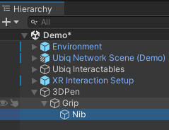

# Creating a 3D Pen for Ubiq

In this short tutorial we'll make a pen that lets us draw shapes in mid-air. We'll add simple networking with Ubiq so you can share your drawings with others!

> This tutorial is intended for Ubiq v1.0.0-pre.7 and may not apply to other versions. In particular, versions of Ubiq prior to v1.0.0-pre.1 do not use Unity's XR Interaction Toolkit.

## Setting up a new Unity project ##

Download and install the Unity editor. We are using Unity 2022.3.32f1. Ubiq v1.0.0-pre.7 is compatible with Unity 2021.3.22 LTS and later.

Create a new Unity project with the 3D template and wait for the editor to open the new project.

## Installing Ubiq as a package ##

Open the Package Manager by selecting 'Window > Package Manager' in the Menu bar at the top of the Unity Editor.


Click the '+' button in the top-left corner of the Package Manager window and select 'Add package from git URL...'


Enter the url `https://github.com/UCL-VR/ubiq.git#upm-unity-v1.0.0-pre.7` and select 'Add' or press enter. This is the URL to install Ubiq v1.0.0-pre.7 specifically.

Wait for Ubiq to be downloaded and imported.

Ubiq will install further dependencies in the background. When this is complete, you will see 'Ubiq successfully modified project requirements.' in the editor console.

## Import the Ubiq XRI Demo sample ##

Back in the Package Manager, select Ubiq from the list on the left. In the pane on the right, switch to the Samples tab, then Import to the 'Demo (XRI)' sample. Wait for the import to complete. If a Unity popup asks about enabling the new Input backend, select Yes.


Open the Ubiq demo scene from the Samples: Assets/Samples/Ubiq/1.0.0-pre.7/Demo (XRI)/Demo.unity

## Setting up a simple pen with primitive shapes ##

Now we have everything we need, let's make a simple object for the pen. We will make a simple stand-in with one big cylinder for the grip and a tiny one for the nib.

Right click in the hierarchy window and select Create Empty. Right click on the object in the hierarchy, select Rename, and give it the name '3DPen'. This will be our parent object. We can use this to customize how our object is picked up.

Now right click on 3DPen in the Hierarchy window and select 3D Object/Cylinder. Rename this cylinder 'Grip'. Right click on Grip and again select 3D Object/Cylinder. Rename this new cylinder 'Nib'. Your hierarchy should now read 3DPen/Grip/Nib, as in the image.



Scale, and translate the objects so they (sort of!) resemble a pen. Do not translate the top object (3DPen), as this will get moved when the user grabs it. Focus on just moving and scaling Grip and Nib. Do not worry about rotation now; we'll deal with this later.

>Tip: the scale of the sample is 1m equals 1 unit.

Finally, position the pen somewhere you can easily reach it. You could try next to the menu. Here's what we ended up with:


## Adding physics and connecting to the XR Interaction Toolkit ##

Select 3DPen in the hierarchy window. Now, in the Inspector window, select Add Component and add an XRGrabInteractable. This will automatically add a Rigidbody. In the Rigidbody, tick 'IsKinematic'. In the XRGrabInteractable, untick 'Throw on Detach'.

> IsKinematic prevents the GameObject's transform being driven by the Physics system. This makes it easier for us to drive it with networking code later on.


The XRGrabInteractable tells the XR Interaction Toolkit how to treat the 3D pen. It now knows it can be picked up and moved around.

Now let's test what we have made so far.

## Testing our work so far - Headset ##

If you have a virtual reality headset to hand, you can test the application by connecting that headset and entering play mode in the editor. Setting up a project for XR is a big topic and varies slightly by headset. A full guide is beyond the scope of this tutorial, but if you are new to working with XR, we provide some recommendations below.

If you have a desktop headset which supports OpenXR we recommend following the Unity instructions [here](https://docs.unity3d.com/Packages/com.unity.xr.openxr@1.7/manual/project-configuration.html). With a correctly set up project, you should then be able to enter Play mode in the editor and Unity will connect to your device.

If you have a mobile or standalone headset, you can create builds for testing but this is slow. As changes will not be reflected in the editor debugging also becomes much more time consuming. You may be able to configure some form of streaming from your development machine to your headset, which can speed up development immensely. See Meta's guide for this feature on the Meta Quest [here](https://developer.oculus.com/documentation/unity/unity-link/). Other standalone headsets (e.g., the XR elite) have similar streaming capabilities.

Once you have your headset set up, enter Play mode and experiment with picking up the pen and moving it around using the 'grab' interaction for your device.

## (Fallback) Testing our work so far - Simulator ##

If you do not have a virtual reality headset for testing, the Demo scene in Ubiq is setup to use Unity's XR Device Simulator by default. The Simulator takes a bit of practice to use but does allow you to functionally test simple interactions without the need for a headset.

The XR Device Simulator control help window will popup in the lower left corner of the Game window when you enter Play mode in the editor. If it does not expand by default, click the '+' symbol on the right hand side of the minimised bar to expand them.

Enter Play mode and experiment with the simulator controls until you can pick up the pen and move it around.

## Drawing in mid-air with the 3D Pen ##

Either using a headset or the simulator, you should now be able to grab and move the pen.

Next let's write a script to get the pen drawing in mid-air. Select 3DPen in the Hierarchy window again. In the Inspector window, select Add Component, and type Pen. Unity will prompt you to add a new script with that name - select New Script, then Create and Add.


This will create the Pen script in your Assets folder and attach that script to the object. Open the file (Assets/Pen.cs) and replace its contents with the following:

``` csharp
using UnityEngine;
using UnityEngine.XR.Interaction.Toolkit;

public class Pen : MonoBehaviour
{
    private Transform nib;
    private Material drawingMaterial;
    private GameObject currentDrawing;

    private void Start()
    {
        nib = transform.Find("Grip/Nib");

        var shader = Shader.Find("Particles/Standard Unlit");
        drawingMaterial = new Material(shader);

        var grab = GetComponent<XRGrabInteractable>();
        grab.activated.AddListener(XRGrabInteractable_Activated);
        grab.deactivated.AddListener(XRGrabInteractable_Deactivated);
    }

    private void XRGrabInteractable_Activated(ActivateEventArgs eventArgs)
    {
        BeginDrawing();
    }

    private void XRGrabInteractable_Deactivated(DeactivateEventArgs eventArgs)
    {
        EndDrawing();
    }

    private void BeginDrawing()
    {
        currentDrawing = new GameObject("Drawing");
        var trail = currentDrawing.AddComponent<TrailRenderer>();
        trail.time = Mathf.Infinity;
        trail.material = drawingMaterial;
        trail.startWidth = .05f;
        trail.endWidth = .05f;
        trail.minVertexDistance = .02f;

        currentDrawing.transform.parent = nib.transform;
        currentDrawing.transform.localPosition = Vector3.zero;
        currentDrawing.transform.localRotation = Quaternion.identity;
    }

    private void EndDrawing()
    {
        currentDrawing.transform.parent = null;
        currentDrawing.GetComponent<TrailRenderer>().emitting = false;
        currentDrawing = null;
    }
}
```

Test using the simulator or a headset. The pen will draw in the air when 'activated' - on most devices, this is when the primary trigger is pulled. A new drawing is created every time the user activates the pen.

## Testing the networking - Building a test application ##

Let's build your application to test networking functionality.

First, go to the top bar, then Edit > Project Settings. In the Project Settings window, select Player from the list on the left. In the pane on the right, expand the 'Resolution and Presentation' foldout, then click the dropdown next to Fullscreen Mode and select Windowed, then set the window to something small, like 640 x 480. This helps us test because we can see both the editor and the application running in a small window.

Now, again in the top bar, go to File/Build and Run. Select a location for the build, and wait for the build to complete.

Note that this assumes your build target is currently Desktop. If you've followed this tutorial from the start, this should be the case by default.

## Testing the networking - Joining a room ##

Now you can run your application in both the editor and as a windowed standalone app. To connect the two, we'll need them both to join the same room.

We do this by interacting with the Ubiq UI panel in the scene. If you are using the simulator, you can use your mouse to interact with the UI (press Escape to stop controlling the simulator). If you are using a headset, you can point at the option you want to select and 'activate' (most likely pull the primary trigger).

Enter play mode in the editor. Select the 'New' button on the Ubiq UI panel in the scene. Leave the name as default, and click the arrow at the top right of the UI panel. Finally, select 'No, keep my room private'. The panel will change to show you a three letter code. This is the 'joincode' for your room. In your standalone windowed application, click Join on the Ubiq sample UI, enter this code, then click the arrow to submit.

## Testing the networking - Comparing the applications ##

Now you have two applications, both connected to the same room. On both, you should now see another avatar in the room with you. Try picking up the object as before. You'll see that it moves for the user who picked it up, but in the other application it stays still. And when you draw with the pen, the other user will not see these drawings either! We'll need to add some networking for both these behaviours.

## Adding networked movement ##

Replace your Pen script (Assets/Pen.cs) with the following:

``` csharp
using UnityEngine;
using UnityEngine.XR.Interaction.Toolkit;
using Ubiq.Messaging; // new

public class Pen : MonoBehaviour
{
    private NetworkContext context; // new
    private bool owner; // new
    private Transform nib;
    private Material drawingMaterial;
    private GameObject currentDrawing;

    // new
    // 1. Define a message format. Lets us know what to expect on send and recv
    private struct Message
    {
        public Vector3 position;
        public Quaternion rotation;

        public Message(Transform transform)
        {
            this.position = transform.position;
            this.rotation = transform.rotation;
        }
    }

    private void Start()
    {
        nib = transform.Find("Grip/Nib");

        var shader = Shader.Find("Sprites/Default");
        drawingMaterial = new Material(shader);

        var grab = GetComponent<XRGrabInteractable>();
        grab.activated.AddListener(XRGrabInteractable_Activated);
        grab.deactivated.AddListener(XRGrabInteractable_Deactivated);

        // new
        grab.selectEntered.AddListener(XRGrabInteractable_SelectEntered);
        grab.selectExited.AddListener(XRGrabInteractable_SelectExited);

        // new
        // 2. Register the object with the network scene. This provides a
        // NetworkID for the object and lets it get messages from remote users
        context = NetworkScene.Register(this);
    }

    // new
    private void FixedUpdate()
    {
        if (owner)
        {
            // 3. Send transform update messages if we are the current 'owner'
            context.SendJson(new Message(transform));
        }
    }

    // new
    public void ProcessMessage (ReferenceCountedSceneGraphMessage msg)
    {
        // 4. Receive and use transform update messages from remote users
        // Here we use them to update our current position
        var data = msg.FromJson<Message>();
        transform.position = data.position;
        transform.rotation = data.rotation;
    }

    private void XRGrabInteractable_Activated(ActivateEventArgs eventArgs)
    {
        BeginDrawing();
    }

    private void XRGrabInteractable_Deactivated(DeactivateEventArgs eventArgs)
    {
        EndDrawing();
    }

    // new
    private void XRGrabInteractable_SelectEntered(SelectEnterEventArgs arg0)
    {
        // 5. The pen has been grabbed. We hold the pen currently, so we're
        // the owner
        owner = true;
    }

    // new
    private void XRGrabInteractable_SelectExited(SelectExitEventArgs eventArgs)
    {
        // 5. The pen has been released. We no longer hold the pen, so we're
        // no longer the owner
        owner = false;
    }

    // Note about ownership: 'ownership' is just one way of designing this
    // kind of script. It's sometimes a useful pattern, but has no special
    // significance outside of this file or in Ubiq more generally.

    private void BeginDrawing()
    {
        currentDrawing = new GameObject("Drawing");
        var trail = currentDrawing.AddComponent<TrailRenderer>();
        trail.time = Mathf.Infinity;
        trail.material = drawingMaterial;
        trail.startWidth = .05f;
        trail.endWidth = .05f;
        trail.minVertexDistance = .02f;

        currentDrawing.transform.parent = nib.transform;
        currentDrawing.transform.localPosition = Vector3.zero;
        currentDrawing.transform.localRotation = Quaternion.identity;
    }

    private void EndDrawing()
    {
        currentDrawing.transform.parent = null;
        currentDrawing.GetComponent<TrailRenderer>().emitting = false;
        currentDrawing = null;
    }
}
```

New lines are marked with a comment. This script does a number of important things, marked in the code.

Test again as in the section 'Testing the networking'. You should now see that when the object is grasped and moved in one application, it also moves in the other.

## Adding networked drawings ##

Time to add networking to our drawings! Replace Pen.cs with the following:

``` csharp
using UnityEngine;
using UnityEngine.XR.Interaction.Toolkit;
using Ubiq.Messaging;

public class Pen : MonoBehaviour
{
    private NetworkContext context;
    private bool owner;
    private Transform nib;
    private Material drawingMaterial;
    private GameObject currentDrawing;

    // 1. Amend message to also store current drawing state
    private struct Message
    {
        public Vector3 position;
        public Quaternion rotation;
        public bool isDrawing; // new

        public Message(Transform transform, bool isDrawing) // new
        {
            this.position = transform.position;
            this.rotation = transform.rotation;
            this.isDrawing = isDrawing; // new
        }
    }

    private void Start()
    {
        nib = transform.Find("Grip/Nib");

        var shader = Shader.Find("Sprites/Default");
        drawingMaterial = new Material(shader);

        var grab = GetComponent<XRGrabInteractable>();
        grab.activated.AddListener(XRGrabInteractable_Activated);
        grab.deactivated.AddListener(XRGrabInteractable_Deactivated);

        grab.selectEntered.AddListener(XRGrabInteractable_SelectEntered);
        grab.selectExited.AddListener(XRGrabInteractable_SelectExited);

        context = NetworkScene.Register(this);
    }

    private void FixedUpdate()
    {
        if (owner)
        {
            // new
            // 2. Send current drawing state if owner
            context.SendJson(new Message(transform,isDrawing:currentDrawing));
        }
    }

    public void ProcessMessage (ReferenceCountedSceneGraphMessage msg)
    {
        var data = msg.FromJson<Message>();
        transform.position = data.position;
        transform.rotation = data.rotation;

        // new
        // 3. Start drawing locally when a remote user starts
        if (data.isDrawing && !currentDrawing)
        {
            BeginDrawing();
        }
        if (!data.isDrawing && currentDrawing)
        {
            EndDrawing();
        }
    }

    private void XRGrabInteractable_Activated(ActivateEventArgs eventArgs)
    {
        BeginDrawing();
    }

    private void XRGrabInteractable_Deactivated(DeactivateEventArgs eventArgs)
    {
        EndDrawing();
    }

    private void XRGrabInteractable_SelectEntered(SelectEnterEventArgs arg0)
    {
        owner = true;
    }

    private void XRGrabInteractable_SelectExited(SelectExitEventArgs eventArgs)
    {
        owner = false;
    }

    private void BeginDrawing()
    {
        currentDrawing = new GameObject("Drawing");
        var trail = currentDrawing.AddComponent<TrailRenderer>();
        trail.time = Mathf.Infinity;
        trail.material = drawingMaterial;
        trail.startWidth = .05f;
        trail.endWidth = .05f;
        trail.minVertexDistance = .02f;

        currentDrawing.transform.parent = nib.transform;
        currentDrawing.transform.localPosition = Vector3.zero;
        currentDrawing.transform.localRotation = Quaternion.identity;
    }

    private void EndDrawing()
    {
        currentDrawing.transform.parent = null;
        currentDrawing.GetComponent<TrailRenderer>().emitting = false;
        currentDrawing = null;
    }
}
```

This adds simple networking to the 3d pen. The approach used is to draw locally when a remote user tells us they are drawing, and stop drawing locally when a remote user tells us they are not.

And we're done! Test it again as in 'Testing the networking', and if you have a headset available, see how it feels in VR!

You might notice a few things about the pen after testing. There's always more functionality to be added! If you're interested, read on for some further exercises and hints.

## Extending this tutorial - new joiners

Drawings are not visible to new joining users. A more advanced implementation would store the points of the drawings in Peer properties. This way new users could see them when they join, and they'll be cleaned up when the user that created them leaves. See the Examples sample in the Ubiq package to get you started.

## Extending this tutorial - ownership

If you try this tutorial out with another user, you might realise you get some strange behaviour when you pass the pen back and forth. This is because the simple version of 'ownership' used in this tutorial is incomplete. When two users both grab the pen, they both consider themselves the owner, and try to control the pen's position.

Ubiq provides the tools to create robust ownership. One option is setting the owner in the Room properties. These are stored on the server, which resolves conflicts and eventually synchronises the same owner with all room peers. See the Examples sample on properties to get an idea of how this works.