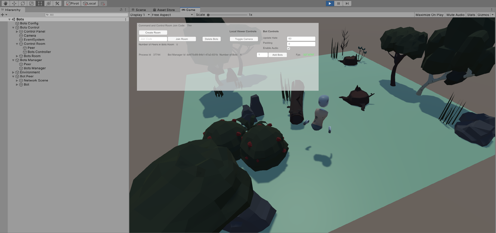

#Bots#

Ubiq has the ability to simulate large numbers of users. This may be useful when stress testing, for example. This is demonstrated in the *Bots* Application Sample.

##Bot Peer##

In a regular application, a user interacts with the world through the `PlayerController`. They connect to the network using a `NetworkScene` and become a *Ubiq Peer*.

It is the same with the Bot and Bot Peer. The Bot GameObject contains Components which interact with the world. Pairing a `Bot` with a `NetworkScene` creates a *Bot Peer*, that can connect to a room and act autonomously.

 

The Bot Peer is equivalent to a user application. In the Editor, the Bot Peer can be joined to a room by using the RoomClient Editor Controls, just like a regular Peer. Alternatively, the default Bot, and others, can be controlled en-masse using the Bots Controller.

 
 
The Bot Peer Prefab can be dropped into new scenes and controlled via the Editor, where small numbers of Bots are required.

###Bot###

The Bot Prefab implements the behaviour of the non-player controlled character. The sample Bot contains a number of common abilities, which can be extended by adding additional custom Components.

**Avatar**

The Bot Peer contains a skeleton allowing it to embody an Avatar at remote peers.

**Behaviour**

The Bot Peer Avatar is controlled by the Bot Component. This uses a nav mesh to move between random points in the environment.

**Audio**

The Bot Peer can speak with a pre-recorded audio clip. This is through a Component that takes the place of the Microphone input in a player-controlled Peer.

##Managing Multiple Bots##
 
Usually, a single Unity process is a single Ubiq Peer, with one NetworkScene. This is because a single PC can usually only drive one set of user input devices at a time.

With bots, a single process can host multiple Bots, but each Bot is still a separate Peer, and has its own NetworkScene. This is achived using the same scene-graph Forests as the *Local Loopback* scene.

 

###BotsManager & BotsController###

The *Bots* Application Sample contains Components to create and manage large numbers of bots.

The `BotsManager` is the Component that creates and configures Bot Peers within a single process. Bots Managers are controlled remotely by a `BotsController`. 

 

The `BotsController` and `BotsManager` use Ubiq to communicate. The `BotsManager` and `BotsController` join the same *Command and Control Room*. The Bot Peers themselves join different rooms, possibly even on different servers. The `BotManager` communicates with the Bot Peers through the local scene graph.

Multiple Bot Managers across different processes can be controlled this way, each managing a number of Bots.

 
 
 A typical Unity process running on a modern desktop can handle approximately 20 bots. All three Components can run within one scene graph, within one process, as in the Bots Sample Scene, or can be split between multiple machines to control hundreds of bots.

*Creating Bots with the Bots Scene*

Opening the Bots scene and pressing Play will show a birds-eye view of the local process, and a control panel. This scene is only meant to be used on the desktop.

 

The Bots scene already has one Bot Peer created. This GameObject's NetworkScene Editor Controls or the Create Room/Join Room Control Panel Buttons can be used to immediately join the Bot into a room with other Peers - bots or normal Peers.

*Stress Testing with the Bots scene*

One of the uses for Bots is stress testing. The Bots Sample is set up to show this.

The Bots Scene contains a number of Components, and a UI.

**Bots Control**

This GameObject contains resources to allow a user to control one or more Bot Managers with the UI. It also includes the Camera and Event Manager. The UI contained under Bots Control drives the `BotsController`, which in turn directs Bot Managers. 

The `BotsController` is in the Control Room GameObject, which has its own NetworkScene and so forms the Bots Controller Peer.
 
This branch also contains a Peer (Bots Room Peer) that can be connected to the Bots' room, in order to do things such as take statistics or collect logs.

**Bots Manager**

The Bots Manager GameObject is the forest for the Bots Manager Peer. Though they are in the same scene graph, the Bots Manager Peer and Bots Controller Peer both join the same command and control room.

**Environment**

To reduce memory overhead, multiple Bot Peers share the same Environment, though as they have their own NetworkScene they don't directly interact outside of Ubiq networking.

**Bot Peer 1**

The Scene includes one Bot Peer instance. The Control Panel can be used to add more.

**Bots Config**

The Bots Config GameObject hosts a helper Component to set which servers the Control Room and Bots Room should be hosted on at design time. By allowing these to be set at design time, the Bots Scene can be built to an executable to be run headless on different machines without needing further configuration.

Make sure to change the Control Room Id before running the sample against Nexus, in case others are running the same sample.

*Controlling Bots*

The Bots Manager is used to spawn new Bot Peer instances. Bot Peers exist in the same application but are completley independent as far as the network, and other peers, are concerned.
The UI in the Bots scene is for the Bot Controller. There is no interface for interacting with the virtual world, VR or otherwise, as there is no Network Scene for players in the Bots example.
Bots can be instructed to join any room however, including those with regular players.

*Command and Control and Bots Rooms*

When the Scene is started, the Control Panel UI will control the local Bot Manager. However, there is a limit to how many Bot Peers a single Unity process can host.

Bot Managers across different Unity processes can work together to control very large numbers of bots.

The Control Panel and Bot Manager are two distinct Ubiq Peers. They communicate using Ubiq Messages through a 'Command and Control' Room.

When the Control Panel starts, it creates a new Room and has the local Bot Manager join it. Additional Bot Managers from other processes can join this room too, and fall under the control of the Control Panel.

The Command and Control Room can be any Ubiq Room, including the one that the Bots join. 

The Room can be set via the command line with the -commandroomjoincode argument. This, combined with -batchmode, can allow many headless Unity instances to spawn bots.

In practice though, when doing things like stress testing, the Room should be different, even on a different server if doing server stress testing.

**Servers**

There are in total four distinct Peers in the single Bots Sample: the Bot Controller (Control Room), the Bot Manager (Control Room), the Bot Room Peer (Bots Room) and the default Bot Peer (Bots Room). 

The Bots Config Component is used to change the server(s) for all of these at once.

The default server for Bot Peer 1 is set in the standard NetworkScene Prefab; it is overridden before connecting when the Control Panel is used to control the Bots.

*Control Panel*

The UI has two sets of controls: Common controls and Instance controls.

Common Controls apply to all Bot Managers, and Instance controls apply to just that Bot Manager.

When only one Bot Manager instance is known, the controls behave identically.

**Toggle Camera**

As each Peer acts as if it were the only one in the process, each Peer will show all other Peers Avatars. This can create high rendering loads. Avatars can be hidden by toggling the Camera, which changes the Culling Mask. The camera is not completley disabled, as it is needed for the UI.

**Enable Audio**

Enables or Disables the audio chat channel for new Bots. This can be used to reduce compute load on the clients. This may be desireable if stress testing a server, for example, as audio data doesn't pass through the server.

**Create/Join Room**

The Create Room button creates a new room for *Bots*, and commands any existing Bots to join it. Alternatively, an existing Join Code can be entered and the Join Room button used. Either can be used as many times as desired to change all the Bots at once, without re-creating the Bots.

**Number of Peers**

Shows the number of Peers in the Bots Room, including the 'dummy' peer. A process may host a number of Bots that have not yet joined a room. Use this figure to monitor the actual number of bots in a room together.

**Bot Manager Instances**

Below the Common Controls each Bot Manager that the Controller is aware of is listed. Each line shows the Id of the Manager, as well as a the number of bots it is hosting. The Input Field and Add Bot Button can be used add new Bots to that instance.

If a Bots Room has been set up, new Bots will automatically join it.

The FPS is used to approximate the performance or load of the Bots Manager. The Colour is controlled by the Fps Gradient member of the Bots Manager Control Prefab (between 0-100 Fps).

##Bot Scene##

The Bots Application Sample also contains a sample scene with a single Bot Peer, along with a Player Peer. This can be used to see what it is like for players to interact with Bots. In this scene, the Player and the Bot should be joined to the same room manually using the RoomClient Editor controls.

