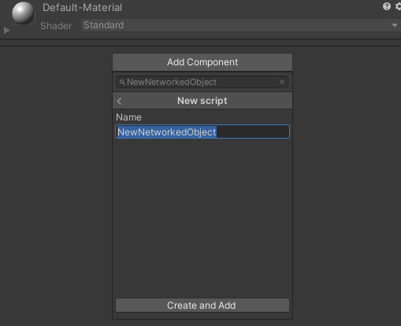

# Building a Basic Networked Object

Networked objects are Components that can keep themselves synchronised by exchanging messages over the network. You can create new Networked Objects to implement your own networked behaviour.

1) Create a new Unity Script and add it to the GameObject that you want to be networked. You can do this via the inspector by clicking on &quot;Add Component&quot; and typing the new name.



2) Include Ubiq.Messaging

```
	using System.Collections;
	using System.Collections.Generic;
	using UnityEngine;
	using Ubiq.Messaging;

	public class MyNetworkedObject : MonoBehaviour
	{
		// Start is called before the first frame update
		void Start()
		{
		}

		// Update is called once per frame
		void Update()
		{

		}
	}
```

3) Create a new member, `context`. `context` will hold the address of your object on the network, and allow you to send messages.

```
using System.Collections;
using System.Collections.Generic;
using UnityEngine;
using Ubiq.Messaging;

public class MyNetworkedObject : MonoBehaviour
{
    NetworkContext context;

    // Start is called before the first frame update
    void Start()
    {

    }

    // Update is called once per frame
    void Update()
    {

    }
}
```


4) Declare a method called `ProcessMessage`, which takes a `ReferenceCountedSceneGraphMessage`. This is where messages to your Component will come in.

```
using System.Collections;
using System.Collections.Generic;
using UnityEngine;
using Ubiq.Messaging;

public class MyNetworkedObject : MonoBehaviour
{
    NetworkContext context;

    // Start is called before the first frame update
    void Start()
    {

    }

    // Update is called once per frame
    void Update()
    {

    }

    public void ProcessMessage(ReferenceCountedSceneGraphMessage message)
    {

    }
}
```

5) In your `Start()` method, call `NetworkScene.Register()`. This registers your Component with Ubiq and gets it an address on the network. The return value is a `NetworkContext` which you can store in the member created previously.


```
using System.Collections;
using System.Collections.Generic;
using UnityEngine;
using Ubiq.Messaging;

public class MyNetworkedObject : MonoBehaviour
{
    NetworkContext context;

    // Start is called before the first frame update
    void Start()
    {
        context = NetworkScene.Register(this);
    }

    // Update is called once per frame
    void Update()
    {

    }

    public void ProcessMessage(ReferenceCountedSceneGraphMessage message)
    {

    }
}
```


6) Define what a message between instances of your Component will look like. In the message, write the variables that you want to send. Below we create a message to send the object's position.


```
using System.Collections;
using System.Collections.Generic;
using UnityEngine;
using Ubiq.Messaging;

public class MyNetworkedObject : MonoBehaviour
{
    NetworkContext context;

    // Start is called before the first frame update
    void Start()
    {
        context = NetworkScene.Register(this);
    }

    // Update is called once per frame
    void Update()
    {

    }

    private struct Message
    {
        public Vector3 position;
    }

    public void ProcessMessage(ReferenceCountedSceneGraphMessage message)
    {

    }
}
```

7) Add code to parse and process incoming messages to `ProcessMessage`. Below, we convert the ReferenceCountedSceneGraphMessage into a Message, and then access the position member to set the object's position in world space.

```
using System.Collections;
using System.Collections.Generic;
using UnityEngine;
using Ubiq.Messaging;

public class MyNetworkedObject : MonoBehaviour
{
    NetworkContext context;

    // Start is called before the first frame update
    void Start()
    {
        context = NetworkScene.Register(this);
    }

    // Update is called once per frame
    void Update()
    {

    }

    private struct Message
    {
        public Vector3 position;
    }

    public void ProcessMessage(ReferenceCountedSceneGraphMessage message)
    {
        // Parse the message
        var m = message.FromJson<Message>();

        // Use the message to update the Component
        transform.localPosition = m.position;
    }
}
```

8) Messages will only be sent to your Component, from other instances of your Component, so you also need to Send messages as well. This is done through the NetworkContext you recieved when the Component was registered.

Below, we check if the position of the object has changed in the last frame, and if so, send the new position to all other instances of the object.
We detect if the position has changed by keeping track of the position in the last frame in a new member, `lastPosition`.

We also modify `ProcessMessage` slightly, to update `lastPosition` when a message is received - otherwise, an incoming message will generate an outgoing message, and two Components will send messages back and forth in an endless cycle even if the player hasn't changed the objects position!


```
using System.Collections;
using System.Collections.Generic;
using UnityEngine;
using Ubiq.Messaging;

public class MyNetworkedObject : MonoBehaviour
{
    NetworkContext context;

    // Start is called before the first frame update
    void Start()
    {
        context = NetworkScene.Register(this);
    }

    Vector3 lastPosition;

    // Update is called once per frame
    void Update()
    {
        if(lastPosition != transform.localPosition)
        {
            lastPosition = transform.localPosition;
            context.SendJson(new Message()
            {
                position = transform.localPosition
            });
        }
    }

    private struct Message
    {
        public Vector3 position;
    }

    public void ProcessMessage(ReferenceCountedSceneGraphMessage message)
    {
        // Parse the message
        var m = message.FromJson<Message>();

        // Use the message to update the Component
        transform.localPosition = m.position;

        // Make sure the logic in Update doesn't trigger as a result of this message
        lastPosition = transform.localPosition;
    }
}
```

9) Your first networked object is now complete!

Add a cube to your object so you can see it in the scene. Continue with the tutorials to see it in action!