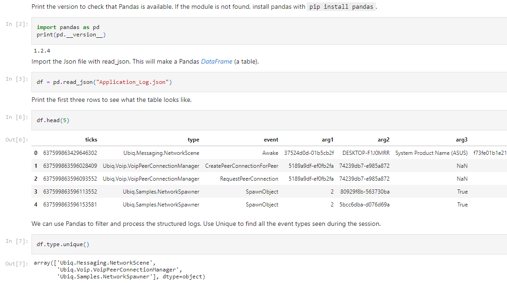

# Analysis

The Event Logger outputs *structured* logs, as Json objects. These can be processed on any platform that can read Json files.

A sample log file is shown below.

```
[
{"ticks":637799309335620180,"peer":"088edbc1-1d1f09b5","type":"Ubiq.Messaging.NetworkScene","event":"Awake","arg1":"DESKTOP-F1J0MRR","arg2":"System Product Name (ASUS)","arg3":"f73fe01b1e21031d49274a1491d1d6b5714c92e9"},
{"ticks":637799309384207356,"peer":"088edbc1-1d1f09b5","type":"Ubiq.Voip.VoipPeerConnectionManager","objectid":"088edbc1-1d1f09b5","componentid":50,"event":"CreatePeerConnectionForPeer","arg1":"6c494697-2e79f5e3","arg2":"26a6ee77-3cec71fe"},
{"ticks":637799309384277353,"peer":"088edbc1-1d1f09b5","type":"Ubiq.Voip.VoipPeerConnectionManager","objectid":"088edbc1-1d1f09b5","componentid":50,"event":"RequestPeerConnection","arg1":"6c494697-2e79f5e3","arg2":"26a6ee77-3cec71fe"},
{"ticks":637799309087959820,"peer":"26a6ee77-3cec71fe","type":"Ubiq.Messaging.NetworkScene","event":"Awake","arg1":"Oculus Quest","arg2":"Oculus Quest","arg3":"b8db4746286db62ecad4c6fa13f17ab6"},
{"ticks":637799309303272560,"peer":"26a6ee77-3cec71fe","type":"Ubiq.Voip.VoipPeerConnectionManager","objectid":"26a6ee77-3cec71fe","componentid":50,"event":"CreatePeerConnectionForRequest","arg1":"6c494697-2e79f5e3"}
]
```

In this example, two peers - a desktop PC (Unity Editor) and an Oculus Quest - join a room. The `NetworkScene` and `VoipPeerConnectionManager` both log events.

Some Json members are defined by the `Emitter` type. For example, the `ContextLogger` writes the `objectid` of the context passed to it on creation. The `arg` members correspond to those passed to the `Log()` method. All entries include a timestamp and the Id of the Peer that generated the log. Timestamps are given in .Net [Ticks](https://docs.microsoft.com/en-us/dotnet/api/system.datetime.ticks).

## Python

Python can be used to analys logs programmatically. The Jupyter notebook below shows how to import and process logs using [Pandas](https://pandas.pydata.org/), a powerful data analysis library for Python.



- [See the Notebook in full](html/b27a1510-38ec-4821-92b1-478dcbcf1ab1.html)
- [Download Jupyter Notebook](files/Debug_Log.ipynb)
- [Download Example Log File](files/Debug_Log.json)


## Excel

Structured event logs are amenable to being viewed in a table. Microsoft Excel PowerQuery can import Json files and load events into Excel Worksheets.

To do this:

1. Open a new `Workbook`
2. From the `Data` tab, choose `Get Data` -> `From File` -> `From Json`
3. Open the log file, for example `Application_log_2021-04-23-10-56-03_0.json`
4. Select the `List` header and click `Convert To Table`. This will instruct Excel to treat each entry as a row.
5. Leave the Default Values in place and Click `OK`. The `View` will now appear as a `Column`.
6. Use the button in the top right to add the `Expand Column` step. This will split each record into a set of columns. Make sure to click `Load More...` if visible to ensure you get every possible field in the table.
7. Click `OK`
8. Click `Close & Load` to build your table.

You can now order by Ticks, and filter columns such as Events.


## Matlab

Like Python, Matlab can load Json using the jsondecode function.

```
% Read the text file and use jsondecode to produce a cell array of
% structures.

events = jsondecode(fileread("Debug_Log.json"));

% The structures will have different fields, so we must use loops to filter
% them before they can be combined into a single struct array or table.

% Below, find all the events of type SpawnObject, and combine them into a
% new array.

spawn = [];

for i = 1:numel(events)
   % The curly braces access the contents of the cell i, which is the
   % struct itself.
   s = events{i};
   if categorical(cellstr(s.event)) == categorical("SpawnObject")
       spawn = [spawn; s];
   end
end

% Convert the new array into a table
T = struct2table(spawn);

% Use the table to change the type of the sceneid column so we can easily
% split the events by which peer they are from.
T.peer = categorical(T.peer);

% Filter the events to keep only those emitted by the Peer that initiated
% the spawn
T = T(T.arg3,:);

% Plot the number of objects spawned over time, by each Peer
figure;
hold all;
peers = unique(T.peer);
for p = peers'
   spawned = T(T.peer == p,:);
   plot(spawned.ticks,1:size(spawned,1));
end

xlabel("Time (ticks)");
ylabel("Number of Objects");
legend(peers);
```


- [Download Matlab Source](files/Debug_Log.m)
- [Download Example Log File](files/Debug_Log.json)