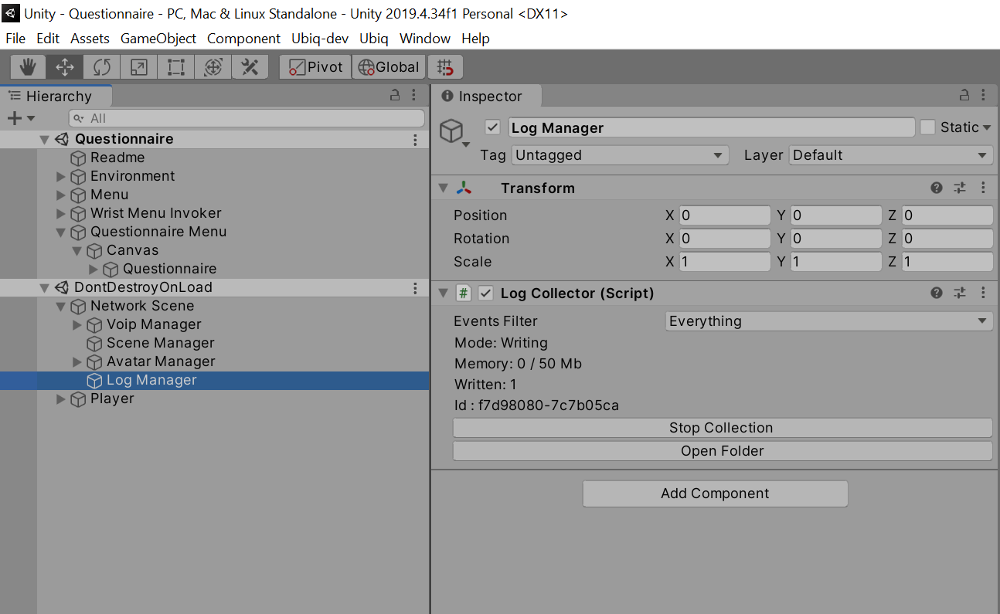

# Questionnaire

The Questionnaire Sample (Samples/Single/Questionnaire) shows how the Event Logging System may be used to collect questionnaire responses.

This scene contains a panel with an example Component, `Questionnaire` attached to it. The Component iterates over all `Slider` instances under its `GameObject`, and uses an `ExperimentLogEmitter` to write their values when the user clicks *Done*.

```
public class Questionnaire : MonoBehaviour
{
	LogEmitter results;

	// Start is called before the first frame update
	void Start()
	{
		results = new ExperimentLogEmitter(this);
	}

	public void Done()
	{
		foreach (var item in GetComponentsInChildren<Slider>())
		{
			results.Log("Answer", item.name, item.value);
		}
	}
	
}
```


The Questionnaire can be completed locally in Play Mode. Alternatively, the scene can be run remotely, and the experimentor in the Editor can join the same room as the remote copy. In either case, the experimentor in the Editor can click *Start Collection* on the `NetworkScene` > `Log Manager` > `LogCollector` to recieve the Questionnaire results.

The experimentor can click *Start Collection* before or after the questionnaire has been completed, and the participant can complete the Questionnaire before or after joining the room. In all cases the results will be receieved correctly.

### Sample Output

Below is the resulting *Experiment* log file from an application built with the Questionnaire scene.

```
[
{"ticks":637795003787005516,"peer":"f7d98080-7c7b05ca","event":"Answer","arg1":"Slider 1","arg2":0.707253},
{"ticks":637795003787045512,"peer":"f7d98080-7c7b05ca","event":"Answer","arg1":"Slider 2","arg2":0.30657154},
{"ticks":637795003787045512,"peer":"f7d98080-7c7b05ca","event":"Answer","arg1":"Slider 3","arg2":0.7034317}
]
```

The Questionnaire was filled in on an Oculus Quest, after joining the same room as a user running the same scene in the Unity Editor. As soon as the Questionnaire was completed, the Unity Editor user could find the *Experiment* log by clicking the *Open Folder* button of the `LogCollector` Component in the Editor.




Since no filters were set up on the `LogManager`, a *Debug* log for the session is also created in the same folder.

```
[
{"ticks":637795043778071253,"peer":"cbc6f82b-24ec48b3","type":"Ubiq.Messaging.NetworkScene","event":"Awake","arg1":"DESKTOP-F1J0MRR","arg2":"System Product Name (ASUS)","arg3":"f73fe01b1e21031d49274a1491d1d6b5714c92e9"},
{"ticks":637795044161926844,"peer":"cbc6f82b-24ec48b3","type":"Ubiq.Samples.NetworkSpawner","objectid":"7725a971-a3692643","componentid":49018,"event":"SpawnObject","arg1":2,"arg2":"1e38967c-7a5701a3","arg3":true},
{"ticks":637795044161966844,"peer":"cbc6f82b-24ec48b3","type":"Ubiq.Voip.VoipPeerConnectionManager","objectid":"cbc6f82b-24ec48b3","componentid":50,"event":"CreatePeerConnectionForPeer","arg1":"2a865340-80169ce2","arg2":"4641730f-148936d7"},
{"ticks":637795044162026839,"peer":"cbc6f82b-24ec48b3","type":"Ubiq.Voip.VoipPeerConnectionManager","objectid":"cbc6f82b-24ec48b3","componentid":50,"event":"RequestPeerConnection","arg1":"2a865340-80169ce2","arg2":"4641730f-148936d7"},
{"ticks":637795044162066856,"peer":"cbc6f82b-24ec48b3","type":"Ubiq.Samples.NetworkSpawner","objectid":"7725a971-a3692643","componentid":49018,"event":"SpawnObject","arg1":2,"arg2":"effadbc0-a6beab2b","arg3":false},
{"ticks":637795043937235620,"peer":"4641730f-148936d7","type":"Ubiq.Messaging.NetworkScene","event":"Awake","arg1":"Oculus Quest","arg2":"Oculus Quest","arg3":"b8db4746286db62ecad4c6fa13f17ab6"},
{"ticks":637795044080181550,"peer":"4641730f-148936d7","type":"Ubiq.Samples.NetworkSpawner","objectid":"7725a971-a3692643","componentid":49018,"event":"SpawnObject","arg1":2,"arg2":"effadbc0-a6beab2b","arg3":true},
{"ticks":637795044152929360,"peer":"4641730f-148936d7","type":"Ubiq.Voip.VoipPeerConnectionManager","objectid":"4641730f-148936d7","componentid":50,"event":"CreatePeerConnectionForRequest","arg1":"2a865340-80169ce2"},
{"ticks":637795044153061850,"peer":"4641730f-148936d7","type":"Ubiq.Samples.NetworkSpawner","objectid":"7725a971-a3692643","componentid":49018,"event":"SpawnObject","arg1":2,"arg2":"1e38967c-7a5701a3","arg3":false}
]
```

### Graceful Exit

The Questionnaire Panel also has a Quit button. This button makes use of the LogCollector WaitForTransmitComplete method to quit the application, but only when the questionnaire results have been successfully delivered.

```
        public void Quit()
        {
            LogCollector.Find(this).WaitForTransmitComplete(results.EventType, ready =>
            {
                if(!ready)
                {
                    // Here it may be desirable to to save the logs another way
                    Debug.LogWarning("ActiveCollector changed or went away: cannot confirm logs have been delivered!");
                }
#if UNITY_EDITOR
                UnityEditor.EditorApplication.isPlaying = false;
#else
                Application.Quit();
#endif
            });
        }
```

The callback will only be called once the Experiment logs have left the local LogCollector.

Enter Play Mode, click Done, then click Quit. 

Since the LogCollector is buffering, the application won't exit because the Log Events are still in Memory. Click Start Collection and the application will immediately write the logs and exit.


Try as well again entering Play Mode, and clicking Done and Quit. This time however join a Room with a LogCollector on another Peer. As soon as that Peer's LogCollector is Started, the Questionnaire will quit. 

If the LogCollector on the other Peer is already active (e.g. in the case of a running logcollectorservice), the application will quit almost as soon as it joins the Room.

