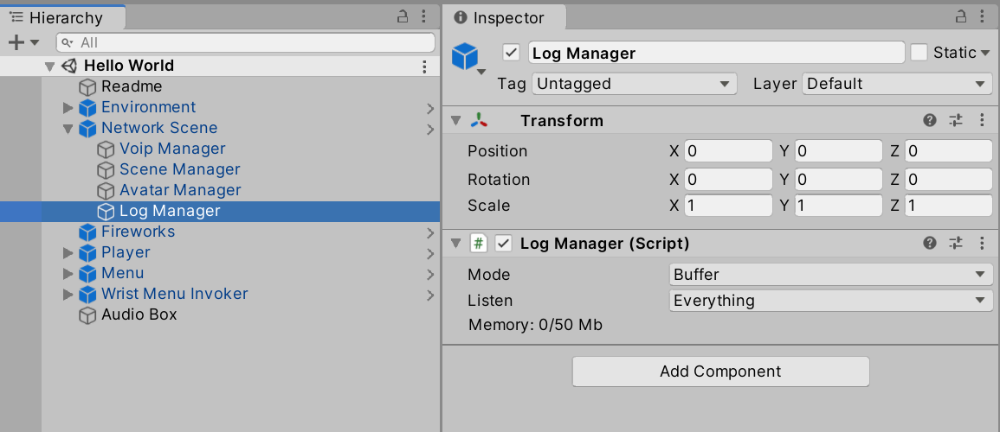
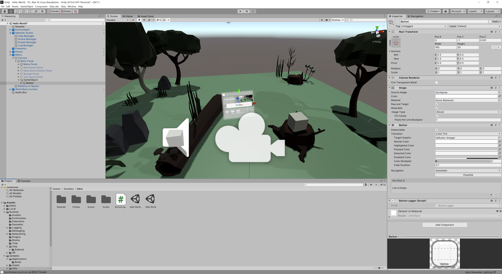
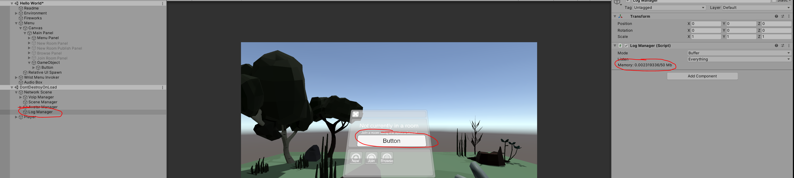
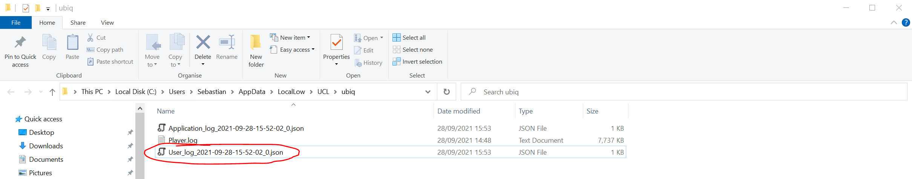
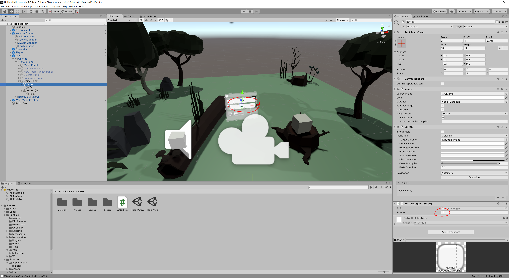
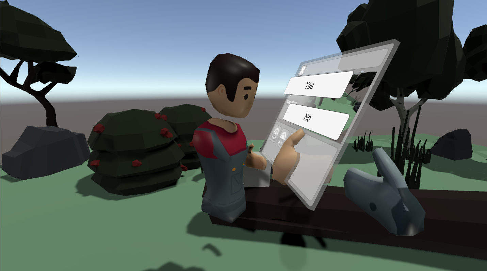

# Logging

Ubiq has the ability to record, forward and store logs. Ubiq itself generates logs, and custom components can create them too.

For example, the logging system could be used to record the answers to a questionnaire, or the direction of a user's gaze, and forward them to an experimentor.

This guide shows how to set up and log some simple data in the *Hello World* scene.

## Log Flow

Log events (such as answering a question) are generated by Log Emitters with a simple call, e.g. `debug.Log("MyEvent")`. These events are received by a Log Collector. `LogCollector` is a Component belonging to a `NetworkScene`. Depending on where logs are finally written, the local `LogCollector` may forward events to another `LogCollector` in the same room, or write them directly to a file.


There can be many Log Emitters in an application. There should be one `LogCollector` per Peer. Only one `LogCollector` should be *writing* at a time.



## Creating a Questionnaire Button

Log events can come from any source. In this guide, they will be generated when a user presses a button.

Create a new `Button` in the scene. Below, a new `GameObject` was added to the *Main Menu*. Create a new script, `ButtonLogger`, and add it to the Button as well.



The script for `ButtonLogger` is below.

```
using Ubiq.Logging;
using UnityEngine;
using UnityEngine.UI;

public class ButtonLogger : MonoBehaviour
{
    ExperimentLogEmitter events;

    // Start is called before the first frame update
    void Start()
    {
        events = new ExperimentLogEmitter(this);
        GetComponent<Button>().onClick.AddListener(OnButtonClicked);
    }

    void OnButtonClicked()
    {
        events.Log("Button Pressed");
    }
}
```


First, an `ExperimentLogEmitter` is declared. This is the object that will be used to emit log events. It is declared in the class but initialised in `Start()`. This is because it has to find the local Log Collector to communicate with, which can't be done until the scene initialisation begins.

#### Event Types

Events can be given a Type. The type hints at the meaning of the event. For example, `Info` events record how the application itself is working. `Experiment` events could record data for experiments. `Debug` events could record simple debugging information.

Any code can create any type of event. The type is used to filter events.

The Emitter created in the `ButtonLogger` script will generate `Experiment` events.

#### Log Collector

The default NetworkScene Prefab already contains a `LogCollector`, so there is no need to add this.

A callback is registered with the Button's `OnClick` event by the `ButtonLogger` script. When this is raised by the user clicking the button, a log event ("Button Pressed") is emitted.

Start the Scene and look at the Log Collector in the Inspector. As the Button is clicked the memory usage of the collector will increase, indicating that the Button is generating events.



### Writing Logs

The events will remain in the `LogCollector` until they are requested.

Click *Start Collection*. The Entries count will increase, and opening the log folder will reveal an Experiment log, with a number of *Button Pressed* events.



```
[{"ticks":637795015469208026,"peer":"f6aa7d01-24da1cf2","event":"Button Pressed"},
{"ticks":637795015470638029,"peer":"f6aa7d01-24da1cf2","event":"Button Pressed"},
{"ticks":637795015471998382,"peer":"f6aa7d01-24da1cf2","event":"Button Pressed"},
{"ticks":637795015473438942,"peer":"f6aa7d01-24da1cf2","event":"Button Pressed"},
{"ticks":637795015474853269,"peer":"f6aa7d01-24da1cf2","event":"Button Pressed"},
{"ticks":637795015476313220,"peer":"f6aa7d01-24da1cf2","event":"Button Pressed"},
{"ticks":637795015477743218,"peer":"f6aa7d01-24da1cf2","event":"Button Pressed"},
{"ticks":637795015479173222,"peer":"f6aa7d01-24da1cf2","event":"Button Pressed"},
{"ticks":637795015480802962,"peer":"f6aa7d01-24da1cf2","event":"Button Pressed"},
{"ticks":637795015482232892,"peer":"f6aa7d01-24da1cf2","event":"Button Pressed"}
```

# Logging Arguments

The `LogEmitter::Log()` method can take a number of arguments in addition to the event name.

Add a new member to the ButtonLogger, `AnswerName`, and pass it in as an argument.

```
    public string Answer;

    void OnButtonClicked()
    {
        events.Log("Button Pressed", Answer);
    }
```

The value of Answer can be set up in the inspector. Duplicate the Button and set two different values of Answer for each.



Now, when looking at the log after pressing the buttons it will show the value of Answer as well.

```
[{"ticks":637795019171902297,"peer":"ba742247-1415eb07","event":"Button Pressed","arg1":"Yes"},
{"ticks":637795019174622297,"peer":"ba742247-1415eb07","event":"Button Pressed","arg1":"Yes"},
{"ticks":637795019180442303,"peer":"ba742247-1415eb07","event":"Button Pressed","arg1":"No"},
{"ticks":637795019183882312,"peer":"ba742247-1415eb07","event":"Button Pressed","arg1":"No"},
{"ticks":637795019201742296,"peer":"ba742247-1415eb07","event":"Button Pressed","arg1":"Yes"}
```

Practically any variable that can be turned into a string can be logged this way.


# Collecting from a Distributed Experiment

So far the `LogCollector` has just collected from the local player.

Create a Build of the *Hello World* application and run it, then press the buttons a few times.

Note that so far, the application has not even joined a room. This is OK because the `LogCollector` will hold all logs until they are requested.

Next, press *Play* to load the *Hello World* Scene in the Editor.

Now have both Peers join the same room (new or old, in any order). When both have joined, the Avatars of the other Peer should be visible in each.



In the Editor, navigate to the `LogCollector` and click on *Start Collection* in the Inspector. 

The Entries count will increase, and an Experiment Log file will appear in the default Logs Folder, containing any answers entered in both the Editor and Standalone Build.

# Considerations

To find out more about the logging, see the [Logging](eventlogging.md) section in the Advanced topics.

Log events can be generated from user actions, but also other external events, or at a regular frequency (e.g. to log the `Transform` of dynamic objects)

You can change the active `LogCollector` at runtime losslessly, so long as no Peers fail or unexpectedly disconnect.

Collection can also be started programmatically, in addition to clicking *Start Collection*. This allows experiment code to start collection other ways, including in Standalone builds.

See the Samples/Single/Questionnaire sample for a complete Questionnaire implementation.