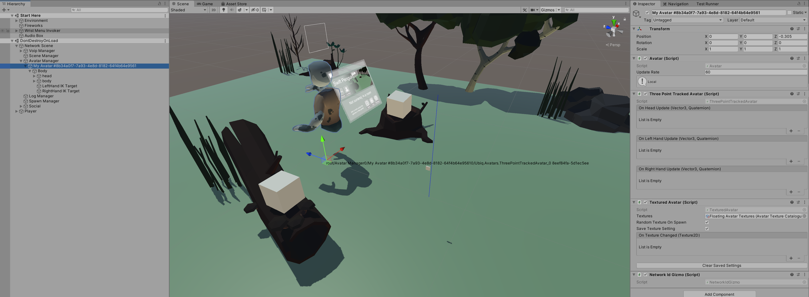

# Network Ids

Network Ids are analogous to the *instance Id* of a Unity Component. This is how Component instances address eachother.

A Component type may exist on one or more GameObjects, or it may exist multiple times on one GameObject. Each of these instances within the Unity Scene or process will have a different *instance Id*, and by default a different *network Id*.

So, if there are two copies of a Prefab in a Scene, they will talk to their respective copies, and only their respective copies, on other Peers.

### Default Network Id

The default behaviour of Ubiq is to generate a Network Id for a Component when it calls Register(). The Id is based on the Component's address is in the scene graph. This is done predominantly by name.

If you have two scenes with the same hierarchy, and two GameObjects with the same name, and same networked Components, those Components will end up with the same Id. This is true even if the scenes are different Unity scenes, or if the scenes are on different devices.

There is some flexibility. For example, if you had two GameObjects with different names, their order in the scene graph could be inverted and the addressing would still work. You couldn't invert the order of GameObjects with the same name however, or put them in different branches of the same scene graph.

### Network Id Gizmo

If you want to see the addresses of your Networked Objects, the NetworkIdGizmo Component can be used to show them at Runtime in the Scene View.

In the image above, `NetworkIdGizmo` is attached to an Avatar. The Avatar has one networked Component - `ThreePointTrackedAvatar` - with an Id of `8eef84fa-5d1ec5ee`.

### Specifying a specific Network Id

The default behaviour is intended to be used where one Unity Scene is created for an application, and that same scene is used by all Peers. In this case, as there is only one scene the addresses between all Peers' Components will always be the same and there is no need to worry about keeping them synchronised.

However, there are many cases where you may want to directly control the Network Id. For example, you may want to pre-share a Network Id to create a service. You may want to send messages from one Component to a Component with a different Network Id.

In these cases you can call `NetworkScene::Register(MonoBehaviour, NetworkId)`. This overload will register the Component with the specified Network Id, instead of generating one automatically, allowing you to use any communication pattern you like for your objects.

### Generating Ids

You can generate a new, unique network Id by calling `NetworkId::Unique()`.

### Network Context & Send

`Register` returns a `NetworkContext` object with a `Send` method. This method sends messages to the same Id as stored in the context (the one registered to the networked Component).

If you want to send messages to a different Network Id, you can call `NetworkScene::Send()` directly, which takes a message and a Network Id to send that message to.
