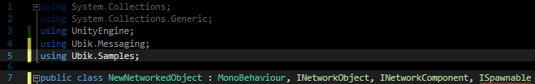

# Additional Object and Networking Functionalities

## Ownership

With this networked object, you will notice that you cannot move them in the editor or change their colour. The reason for this is that both objects are sending each other their position and any change you make gets overwritten by the incoming messages before it can go out. This situation where two changes race against each other is called a &quot;race condition&quot;. One easy way to prevent this, is to give one of the network objects a flag that signals whether the object is owned by the local instance or controlled by a remote one. This is not only useful for interaction between the player and the object, but also for when the object is controlled by the physics system!

1. Add a bool that signals whether the object is locally owned and should send or whether it is owned by a remote instance and should only receive.
2. Add a if-clause that prevents the object from sending when not owned locally

After that, it should look like this:

Now, however, it must be determined somehow if the object was spawned locally or remote to set the owner flag accordingly. For objects spawned by the NetworkSpawner (see section &quot;Spawning Objects&quot; below), this is easy and described here. For objects that are part of the scenery and already present at the start of the game, the objects will somehow need to negotiate an owner or find another way to prevent a race condition. We leave that to your ingenuity ;-)

1. Include Ubik.Samples and inherit ISpawnable

 

2. Implement the Interface. It only consist of one function: OnSpawned(bool local). The parameter &quot;local&quot; is either true if the object is owned locally or false if it is a remote object. You can directly assign that to &quot;owner&quot;.

 
