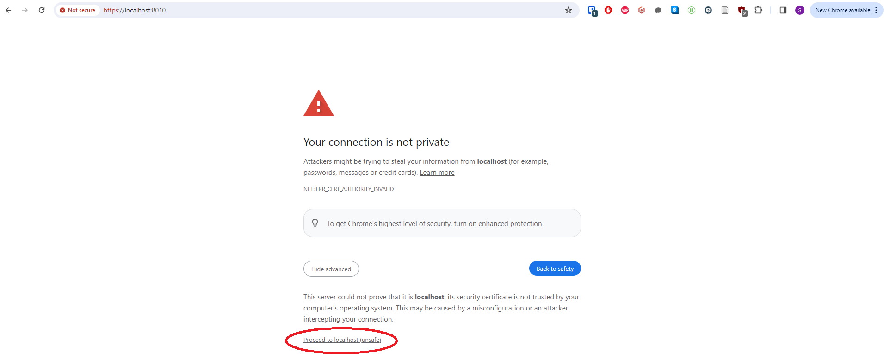

# Quick Start

The server code is included in the Ubiq repository in the `Node` directory.

After checking out the code, run,

```
npm install
``` 

in the `Node` directory. The server can then be started with,

```
npm start
```

This will start a server with the default TCP port - the same one running on Nexus - that Unity can connect to. Continue below if you also need to support Browser Clients.

# Advanced

## Supporting Secure WebSockets

If you are intending to create Browser Clients with Ubiq's JavaScript library, you will need to support Secure WebSockets.

This is done by providing a certificate for the server.

The quickest way to do this is to create a self-signed certificate using, e.g. OpenSSL. In the `Node` directory, give the command,

```
openssl req  -nodes -new -x509  -keyout key.pem -out cert.pem
```

If successful, starting the server will look something like:

```
Added RoomServer port 8009
Added RoomServer port 8010
Added status server on port 8011
```

Self-signed certificates are unlikely to be accepted by default on most browsers. You will need to visit,

```
https://localhost:8010
```

And agree to proceed, before that browser will establish Ubiq connections.



## Using VSCode

If you would like to run the server in VSCode, open the `Node` Folder in VSCode, and create the following launch configuration,

```
{
	"type": "pwa-node",
	"request": "launch",
	"name": "Launch Server",
	"skipFiles": [
		"<node_internals>/**"
	],
	"env": {"NODE_OPTIONS": "--loader ts-node/esm"},
	"program": "${workspaceFolder}\\app.ts",
	"console": "integratedTerminal"
}
```

## Status Module API Keys

If you want to limit access to the sensitive status module pages/APIs, you need to specify one or more API keys, for example:

```
{
	"status":{
		"apikeys": ["bf692145-80b1-40da-ba53-9c9dfdf7a5a7"]
	}
}
```

You can copy this snippet into a new `config\local.json` file, or add your keys into the existing empty `apikeys` member in `config\default.json`.


## Alternatives ways to start the server

The server can also be started with:

```
 node --loader ts-node/esm app.ts
```

or

```
 NODE_OPTIONS="--loader ts-node/esm"
 node app.ts
```

This is because server project is written in [TypeScript](https://www.typescriptlang.org/) and is set up to use the Node [ESM Loaders](https://dev.to/jakobjingleheimer/custom-esm-loaders-who-what-when-where-why-how-4i1o) feature to execute TypeScript (`.ts`) files directly without transpilation.

This requires the correct loader to be specified, which is done using the `--loader` parameter, either each time Node is started, or through the `NODE_OPTIONS` environment variable. (`npm start` is simply an alias for `node --loader ts-node/esm app.ts`).


