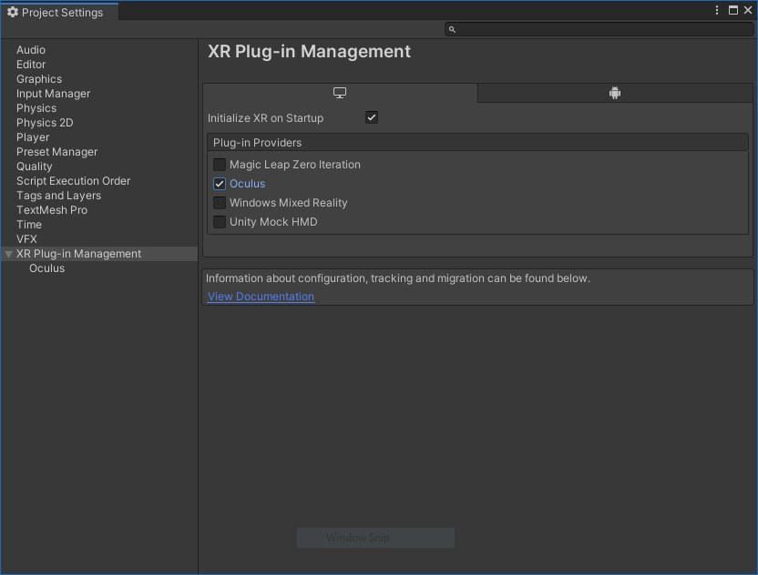
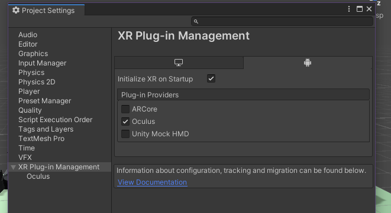

# Setting Up Ubik for VR

Ubiq uses Unity's XR Plug-in Management system for all samples. This allows you to enable a VR plugin matching your device and to interact with it through a unified interface. There is a quick guide below for each supported platform.

## Oculus or Windows Mixed Reality (desktop)

1. In Unity, open the project settings window (Edit/Project Settings/...) and go to the XR Plug-in Management menu.

2. Enable the plug-in here - just tick either the Oculus or Windows Mixed Reality box. Also tick the box for "Initialize XR on Startup".

## OpenVR (desktop)

1\. Note that while rendering and tracking works well, this subsystem is currently missing input from the hand controllers. Unfortunately, this is a limitation with the plugin and a fix does not seem to be on the horizon.

2\. Follow the instructions to download the OpenVR Unity XR plug-in here: https://github.com/ValveSoftware/unity-xr-plugin/releases/tag/installer

## Oculus Quest

1\. Install android build tools. In Unity Hub, click `Installs` on the left-hand menu. Click the three dots in the top right corner of the box for your Unity installation and select `Add modules` from the dropdown. Select `Android Build Support` and both subsequent options (`Android SDK & NDK Tools` and `OpenJDK`). Wait for installation to complete, then re-open your project.

2\. In Unity, open the project settings window (Edit/Project Settings/...) and go to the XR Plug-in Management menu.

3\. Click the Android tab and check the boxes for Oculus and "Initialize XR on Startup".

If your Quest is connected with Oculus Link, you can now test your applications by entering Play Mode in the Unity Editor.

4\. (Optional) To create your first build for the Quest, follow the Oculus `Enable Device for Development and Testing` guide: https://developer.oculus.com/documentation/unity/unity-enable-device/
