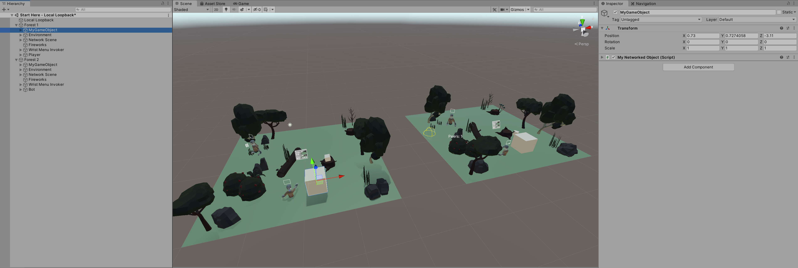

# Synchronisation

### Try out your Prefab

Add a copy of your Prefab from the first tutorial page into each Forest and press Play.



Drag one of your GameObjects around, and see it change in the other scene. Try and drag the second instance around, and see the first one change position.

Your MyNetworkedObject Component synchronises the object's positions by looking for *external* changes each frame. This achieved in the `Update` method:

```
if(lastPosition != transform.localPosition)
{
	lastPosition = transform.localPosition;
	context.SendJson(new Message()
	{
		position = transform.localPosition
	});
}
```

If the position doesn't change within a frame, then no updates are sent.

The position only changes in one of two ways:

1. Something outside the script moves the object in *this Peer*.
2. A message from another instance moves the object.

In the second case, the position is updated but no message is sent, because it means something moved the object in *another Peer*.


### Ownership

This approach of sending only local changes is simple, but isn't perfect.

Have a friend join a Room containing your object, and see what happens when you both try and move it at the same time.

In networked environments, two users can try to change the same thing at the same time. How those conflicts are resolved is up to you. 

Another straightforward approach is to use Ownership Based Synchronisation.

In this case, a variable specifies who "owns" an object. Only the owner can send updates, and all other instances only receive them. This is how the Firework example is implemented:

```
private void Update()
{
	if(attached)
	{
		transform.position = attached.transform.position;
		transform.rotation = attached.transform.rotation;
	}
	if(owner)
	{
		context.SendJson(new Message(transform, fired));
	}
	if(owner && fired)
	{
		body.isKinematic = false;
		body.AddForce(transform.up * 0.75f, ForceMode.Force);

		if (!particles.isPlaying)
		{
			particles.Play();
			body.AddForce(new Vector3(Random.value, Random.value, Random.value) * 1.1f, ForceMode.Force);
		}
	}
	if(!owner && fired)
	{
		if (!particles.isPlaying)
		{
			particles.Play();
		}
	}
}
```

See how the behaviour of the script changes depending on the state of the `owner` flag. Only the owner can apply forces to the object, or send its position onto the network. Other instances simply attempt to make their local object match the state sent to them by the owner.


### Spawning

When you create your own objects, you (or your code) decides which instance is the owner.

For example, in the case of the Firework, the Fireworks Box sets the Owner flag when it spawns the object.

Since the `Owner` flag defaults to `false`, spawned objects on remote instances will have this set to `false` and all objects will be configured correctly.

