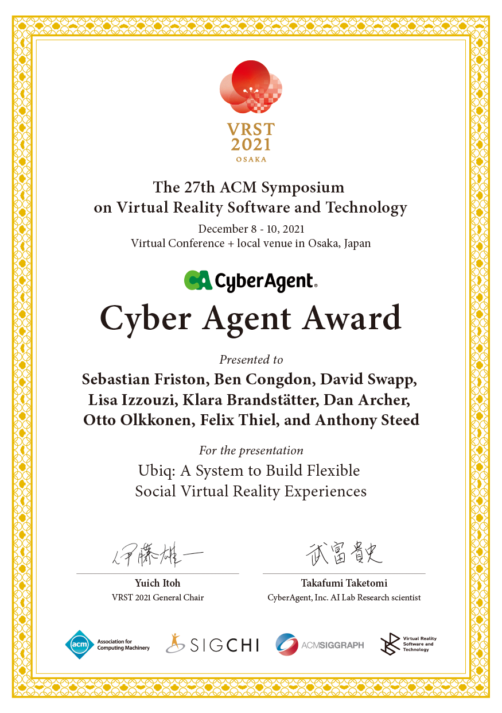

# Welcome to Ubiq


Ubiq is a Unity networking library for research, teaching and development, maintained by the Virtual Environments and Computer Graphics group at UCL.
Ubiq is 100% free and open source.

## Features

Ubiq's goal is to enable your networked project. It includes message passing, room management, rendezvous and matchmaking, object spawning, shared binary blobs, multiple synchronisation models, lighweight XR interaction examples, customisable avatars and voice chat across Windows, Linux, Android, MacOS, and Javascript running in the browser.

## For Researchers

Instructions for setting up your own server are included. Ubiq does not rely on any third-party services, making it GDPR-safe for your experiments.

## Documentation

To find out more about Ubiq please visit our Introduction [here](https://ucl-vr.github.io/ubiq/).

## Quick Start

1. Clone this repository somewhere on your local PC.

```
git clone git@github.com:UCL-VR/ubiq.git Ubiq
```

2. Open the `Unity` folder in Unity. To add Ubiq to the `Unity Hub`, open the `Unity Hub`, click `Add`, then navigate to `/Ubiq/Unity` and click `Select Folder`.

3. Open the `Assets/Samples/Intro/Hello World` scene.

4. Click `Play`.

You're connected!

For next steps see our Getting Started guide.

## Awards


